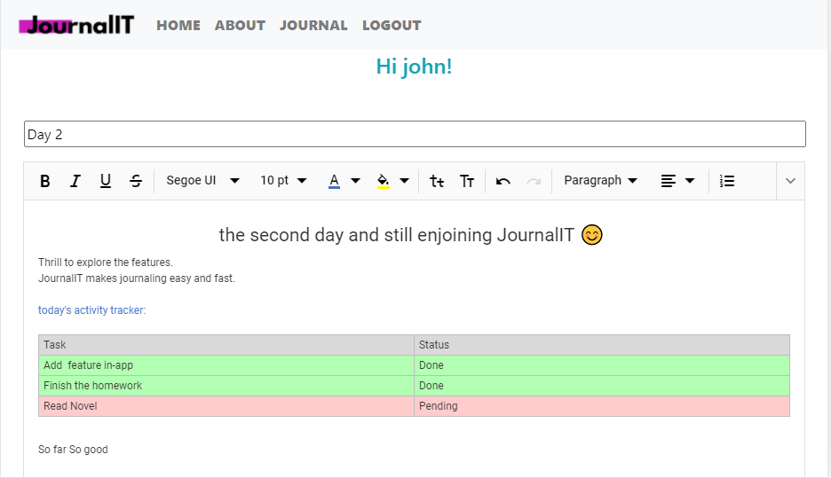

<!--
*** Thanks for checking out this README Template. If you have a suggestion that would
*** make this better, please fork the repo and create a pull request or simply open
*** an issue with the tag "enhancement".
*** Thanks again! Now go create something AMAZING! :D
***
***
***
*** To avoid retyping too much info. Do a search and replace for the following:
*** github_username, repo_name, twitter_handle, email
-->


<!-- PROJECT SHIELDS -->
<!--
*** I'm using markdown "reference style" links for readability.
*** Reference links are enclosed in brackets [ ] instead of parentheses ( ).
*** See the bottom of this document for the declaration of the reference variables
*** for contributors-url, forks-url, etc. This is an optional, concise syntax you may use.
*** https://www.markdownguide.org/basic-syntax/#reference-style-links
-->
[![Contributors][contributors-shield]][contributors-url]
[![Forks][forks-shield]][forks-url]
[![Stargazers][stars-shield]][stars-url]
[![Issues][issues-shield]][issues-url]
[![MIT License][license-shield]][license-url]
[![LinkedIn][linkedin-shield]][linkedin-url]


<!-- PROJECT LOGO -->
<br />
<p align="center">
  <a href="https://myjournalit.herokuapp.com/">
    
  </a>

  <h2 align="center" >JournalIT</h2>

  <p align="center">
    Your Digital Journal 
    <br />
    <a href="https://github.com/vishalmanes109/JournalIt"><strong>Explore the docs »</strong></a>
    <br />
    <br />
    <a href="https://myjournalit.herokuapp.com/">View Demo</a>
    ·
    <a href="https://github.com/vishalmanes109/JournalIt/issues">Report Bug</a>
    ·
    <a href="https://github.com/vishalmanes109/JournalIt/issues">Request Feature</a>
  </p>
</p>


<!-- TABLE OF CONTENTS -->
## Table of Contents

* [About the Project](#about-the-project)
  * [Built With](#built-with)
* [Getting Started](#getting-started)
  * [Prerequisites](#prerequisites)
  * [Installation](#installation)
* [Usage](#usage)
* [Roadmap](#roadmap)
* [Contributing](#contributing)
* [License](#license)
* [Contact](#contact)
* [Acknowledgements](#acknowledgements)


<!-- ABOUT THE PROJECT -->
## About The Project

[![Product Name Screen Shot][product-screenshot]](https://myjournalit.herokuapp.com/)

### JournalIT:
* JournalIT is a free website which helps you to keep your digital journal. JournalIT is a free website which keeps all data secured with a complex encryption algorithm. 
`vishalmanes109`, `JournalIT`, `crcevishal@gmail.com`

    


 <a href="https://myjournalit.herokuapp.com/"> Visit Now
  </a>

### screnshots

   


   


   



### Built With

* [ Angular]( https://cli.angular.io/)
* [ Angular CLI version 9.0.6. ]( https://cli.angular.io/)
* [ Boostrap]( https://getbootstrap.com/ )
* [MongoDB]( https://www.mongodb.com/)
* [Express]( https://expressjs.com/)
* [NodeJs]( https://nodejs.org/en/)
* [syncfusion rich text editor](https://www.syncfusion.com/kb/9864/how-to-get-started-easily-with-syncfusion-angular-7-rich-text-editor)


<!-- GETTING STARTED -->
## Getting Started

To get a local copy up and running follow these simple steps.

### Prerequisites

This is an example of how to list things you need to use the software and how to install them.
* npm
* nodejs
* mongoDB
* express

* npm
```sh
npm install npm@latest -g
```
* nodemon
```sh
npm install nodemon -g
```

### Installation

1. Clone the repo
```sh
git clone https://github.com/vishalmanes109/JournalIt.git

```
2. Install NPM packages
```sh
npm install
```

3. Install the Syncfusion packages 
```sh
npm install @syncfusion/ej2-angular-richtexteditor --save
```
<!-- USAGE EXAMPLES -->
  

## Usage

JournalIT is used to record unlimited olnine journal/diary with simple UI and encryption.  

_For more info, please refer to the [about JournalIT](https://myjournalit.herokuapp.com/about)_


<!-- ROADMAP -->
## Roadmap

See the [open issues](https://github.com/vishalmanes109/JournalIt/issues) for a list of proposed features (and known issues).


<!-- CONTRIBUTING -->
## Contributing

 Any contributions you make are **greatly appreciated**.

1. Fork the Project
2. Create your Feature Branch (`git checkout -b feature/AmazingFeature`)
3. Commit your Changes (`git commit -m 'Add some AmazingFeature'`)
4. Push to the Branch (`git push origin feature/AmazingFeature`)
5. Open a Pull Request


<!-- LICENSE -->
## License

Distributed under the MIT License. See `LICENSE` for more information.


<!-- CONTACT -->
## Contact

Vishal Mane - [@linkedIn](https://www.linkedin.com/in/vishalm109/) - crcevishal@gmail.com

Project Link: [https://github.com/vishalmanes109/JournalIt](https://github.com/vishalmanes109/JournalIt)


<!-- ACKNOWLEDGEMENTS -->
## Acknowledgements

* [ SyncFusion ](https://www.syncfusion.com/kb/9864/how-to-get-started-easily-with-syncfusion-angular-7-rich-text-editor)


<!-- MARKDOWN LINKS & IMAGES -->
<!-- https://www.markdownguide.org/basic-syntax/#reference-style-links -->
[contributors-shield]: https://img.shields.io/github/contributors/github_username/repo.svg?style=flat-square
[contributors-url]: https://github.com/vishalmanes109/JournalIt/graphs/contributors
[forks-shield]: https://img.shields.io/github/forks/github_username/repo.svg?style=flat-square
[forks-url]: https://github.com/vishalmanes109/JournalIt/network/members
[stars-shield]: https://img.shields.io/github/stars/github_username/repo.svg?style=flat-square
[stars-url]: https://github.com/vishalmanes109/JournalIt/stargazers
[issues-shield]: https://img.shields.io/github/issues/github_username/repo.svg?style=flat-square
[issues-url]: https://github.com/vishalmanes109/JournalIt/issues
[license-shield]: https://img.shields.io/github/license/github_username/repo.svg?style=flat-square
[license-url]: https://github.com/vishalmanes109/JournalIt/blob/master/LICENSE.txt
[linkedin-shield]: https://img.shields.io/badge/-LinkedIn-black.svg?style=flat-square&logo=linkedin&colorB=555
[linkedin-url]: https://www.linkedin.com/in/vishalm109/
[product-screenshot]: img/title.png


# JournalIT

This project was generated with [Angular CLI](https://github.com/angular/angular-cli) version 9.0.6.

## Development server

Run `ng serve` for a dev server. Navigate to `http://localhost:4200/`. The app will automatically reload if you change any of the source files.

## Code scaffolding

Run `ng generate component component-name` to generate a new component. You can also use `ng generate directive|pipe|service|class|guard|interface|enum|module`.

## Build

Run `ng build` to build the project. The build artifacts will be stored in the `dist/` directory. Use the `--prod` flag for a production build.

## Running unit tests

Run `ng test` to execute the unit tests via [Karma](https://karma-runner.github.io).

## Running end-to-end tests

Run `ng e2e` to execute the end-to-end tests via [Protractor](http://www.protractortest.org/).

## Further help

To get more help on the Angular CLI use `ng help` or go check out the [Angular CLI README](https://github.com/angular/angular-cli/blob/master/README.md).
